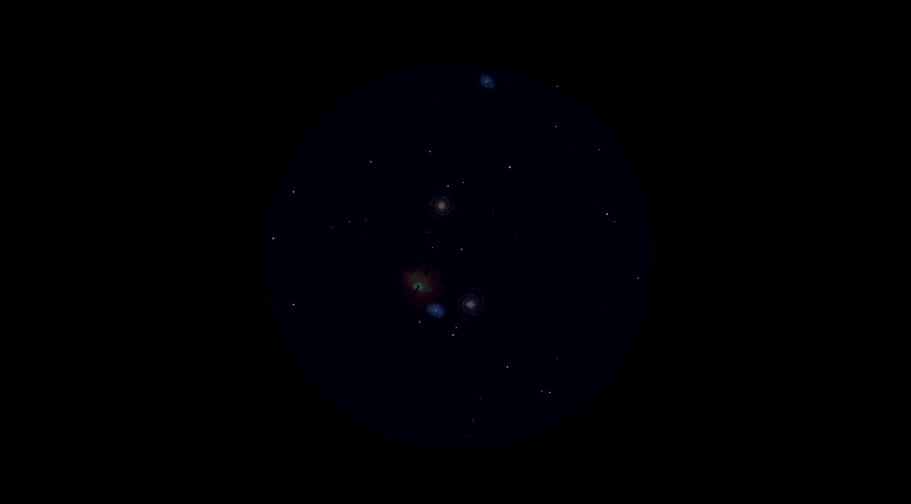

# Deep Sky Viewer


A relaxing real-time deep-sky observation simulator built in Unity.

Explore procedurally generated galaxies, nebulae, and star clusters through a controllable telescope in a stylized low-poly night environment.





---


## Features


* Real-time procedural generation of deep-sky objects


&#x20; * Galaxies

&#x20; * Nebulae

&#x20; * Open and globular star clusters

* Interactive telescope system with zoom and aiming

* Free-roam first-person exploration

* Stylized low-poly environment with atmospheric lighting

* Exaggerated, artistic deep-sky rendering inspired by EAA-style observations

* Modular architecture designed for future optical simulation (lens effects, sensor response, distortion)


---


## Controls


### Movement


* WASD – Move

* Shift – Sprint

* Mouse – Look around


### Telescope Interaction


* E – Enter / Exit telescope mode

* F – Enter / Exit eyepiece view

* Mouse – Aim telescope


---


## Tech Stack


* Engine: Unity

* Render Pipeline: Universal Render Pipeline (URP)

* Language: C#

* Generation: Procedural noise (Perlin / FBM-based systems)

* Rendering: Real-time generated textures for deep-sky objects


---


## Getting Started


### 1. Clone the repo


```bash

git clone https://github.com/mrpoes/deep-sky-viewer.git

cd deep-sky-viewer

```


---


### 2. Open in Unity


Open the project in a compatible Unity version with URP enabled.


---


### 3. Load the scene


Assets/SimpleNaturePack/Scenes/TelescopeGame.unity


Then press Play.


---


## Project Structure


```

DeepSkyViewer/

├── Assets/

│   ├── Scripts/        # Player, telescope, procedural generation, camera control

│   ├── Scenes/         # Main scene(s)

│   ├── Images/         # Textures and visual assets

│   ├── Resources/      # Runtime-loaded assets

│   ├── Settings/       # Project and system settings

│   ├── SimpleNaturePack/ # Environment assets

│   ├── Starter Assets/ # Starter character and input systems

│   ├── TextMesh Pro/   # Text rendering assets

│   └── TutorialInfo/   # Sample/tutorial content

├── ProjectSettings/

├── Packages/

└── README.md

```


---


## Planned Features


* Telescope optical simulation system


&#x20; * Lens types and aberrations

&#x20; * Sensor noise and exposure simulation

* Atmospheric seeing effects

* Improved sky navigation system

* More advanced procedural sky layering

* Post-processing per telescope type


---


## Design Goals


* Relaxing, meditative exploration experience

* No objectives or progression systems

* Focus on observation and atmosphere

* Procedural content ensuring infinite variation

* Blend of stylized visuals with astronomy-inspired structure


---


## License


MIT License


